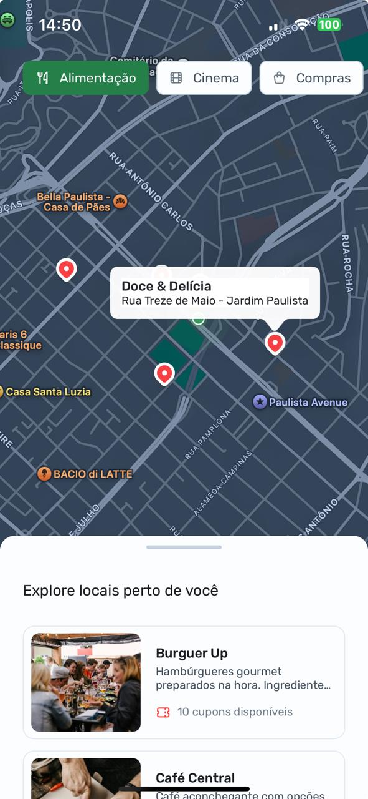
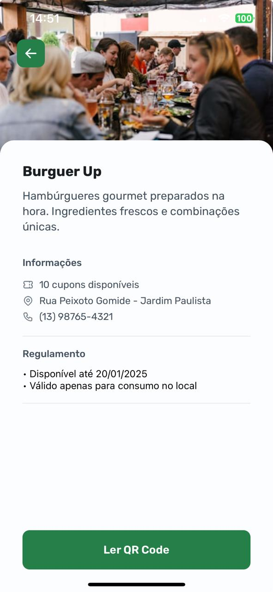

# NLW Pocket: Mobile - Rocketseat

Este projeto foi desenvolvido durante o evento **NLW 18 Pocket Mobile**, promovido pela [Rocketseat](https://www.rocketseat.com.br). O evento teve como objetivo capacitar desenvolvedores no desenvolvimento de aplicativos móveis, oferecendo trilhas de aprendizado prático e guiado por especialistas.

## Projeto Nearby

O **Nearby** é um aplicativo de clube de benefícios que permite aos usuários explorar e acessar descontos e ofertas exclusivas em locais próximos a sua localização atual. O aplicativo foi desenvolvido com foco em boas práticas de desenvolvimento e na criação de uma interface moderna e intuitiva.

### Funcionalidades Principais

- Exibição de locais com benefícios próximos ao usuário.
- Filtro por categorias de locais.
- Integração com mapas para visualização das localizações.
- Uso da câmera para leitura de QR Codes.
- Callouts interativos para detalhamento de cada local.


### Trilhas do Evento

- **React Native**: Para desenvolvimento multiplataforma (Android e iOS).

### Ferramentas e Bibliotecas

- **React Native Maps**: Para renderização de mapas e interatividade com marcadores.
- **Expo**: Para facilitação no desenvolvimento e testes.
- **Axios**: Para comunicação com APIs.
- **Expo Location**: Para acesso à localização do usuário.
- **Expo Camera**: Para uso da câmera no aplicativo.

## O Que Foi Aprendido

- Configuração inicial de projetos com **Expo** e gerenciamento de dependências.
- Uso da biblioteca **React Native Maps** para exibir mapas e marcadores interativos.
- Integração de **APIs REST** com o uso de Axios.
- Gerenciamento de estados e manipulação de dados com **React Hooks**.
- Controle de permissões e uso de serviços de localização com **Expo Location**.
- Uso da câmera do dispositivo com **Expo Camera**.

## Imagens do Projeto

### Mapa com Callouts e Filtro de Categorias



### Detalhes do Local



## Como Executar o Projeto

1. Clone este repositório:
   ```bash
   git clone https://github.com/seu-usuario/nlw-pocket-nearby.git
   ```
2. Navegue até a pasta do projeto:
   ```bash
   cd mobile
   ```
3. Instale as dependências:
   ```bash
   npm i
   ```
4. Inicie o projeto:
   ```bash
   npx expo start
   ```
5. Escaneie o código QR no seu dispositivo móvel usando o aplicativo **Expo Go**.

## Conclusão

Este projeto foi uma excelente oportunidade para aprofundar conhecimentos em desenvolvimento mobile e aprender novas ferramentas e boas práticas. A experiência do evento foi enriquecedora, com suporte da comunidade e acompanhamento dos especialistas da Rocketseat.

Qualquer dúva ou sugestão, sinta-se à vontade para abrir uma **issue** ou enviar um **pull request**. 🚀

